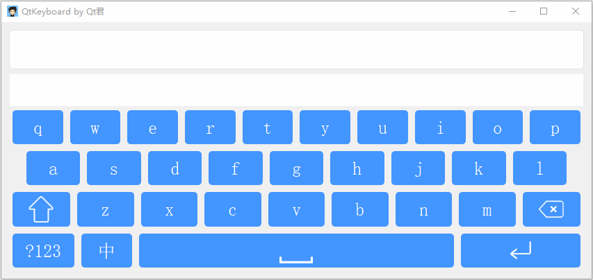
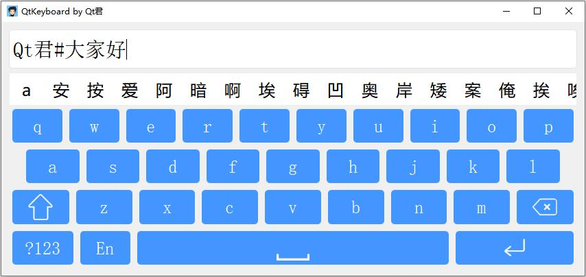
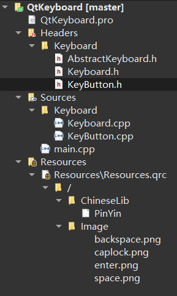

> 本文介绍Qt君最近编写的一个Qt键盘，该键盘主要功能有大小写切换，中英文切换，实现数字输入，符号输入等基本功能，未来还会支持换肤，手写功能。


  
# 实现初衷
* 供大家交流学习；
* 希望以轻量级(嵌入式设备)键盘为特点不断**发展**该键盘项目(**源码地址**在文末)。  


# 项目预览
* 文件**目录**  


* 基类键盘**AbstractKeyboard**
```cpp
class AbstractKeyboard : public QWidget
{
    Q_OBJECT
public:
    AbstractKeyboard(QWidget *parent = 0);
    ~AbstractKeyboard();

    const QString name();
    void setName(const QString &name);

public slots:
    virtual void update(const QString &text);
    void onKeyPressed(int key, QString value);

signals:
    void keyPressed(int key, QString value);
};
```

* 实现类键盘**Keyboard**
```cpp
class Keyboard : public AbstractKeyboard
{
    Q_OBJECT
public:
    Keyboard(QWidget *parent = NULL);

protected:
    void resizeEvent(QResizeEvent *e);

private slots:
    void switchCapsLock();
    void switchSpecialChar();
    void switchEnOrCh();
};
```

* 键盘按钮**KeyButton**
```cpp
class KeyButton : public QPushButton
{
    Q_OBJECT
public:
    enum Type { Auto = 0, LowerCase, UpperCase, SpecialChar };

    struct Mode {
        int key;          /* Qt::Key */
        QString value;    /* text */
        QString display;  /* display text */
        Type type;        /* default: Auto */
    };

    KeyButton(const QList<Mode> modes = QList<Mode>(), QWidget *parent = NULL);
    Mode mode();

    void onReponse(const QObject* receiverObj, const QString &receiver);

    void switchCapsLock();
    void switchSpecialChar();
    void switching(); /* Cycle switch. */

signals:
    void pressed(int key, QString value);
};
```

# 文章更新
* 轻量级Qt键盘-介绍篇
* 轻量级Qt键盘-原理篇
* 轻量级Qt键盘-实现篇
* 轻量级Qt键盘-中文输入
* 后续会不定期更新关于主要新增功能介绍文章。  

# 关于更多
* **源码地址**：
```
https://github.com/aeagean/QtKeyboard
```

* 本文首发公众号：**Qt君**  
<p align="center">
  
  <p align="center"><em>Qt君</em></p>
</p>
